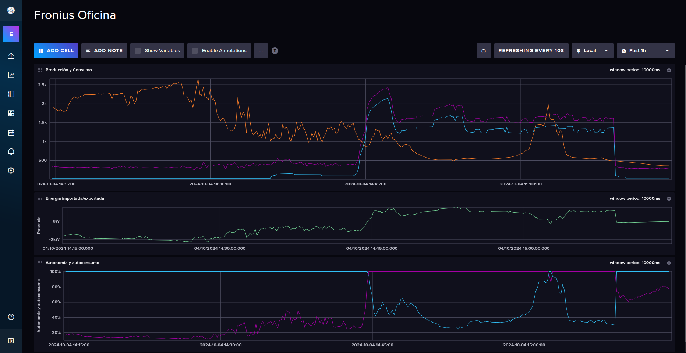

Here’s the updated `README.md` file based on your requirements:

---

# Fronius Datamanager Logger and Monitor

This repository contains a Docker Compose stack designed to capture real-time photovoltaic (PV) production data from a Fronius inverter capable of using SolarAPI v.1. The stack consists of two services:

- **Telegraf**: An agent that listens for push calls from the inverter through an exposed HTTP endpoint.
- **InfluxDB**: A database that stores the PV production data for analysis and monitoring.

The Fronius inverter uses the **SolarAPI v1 - CurrentData - PowerFlow** to push energy flow data to Telegraf. This service sends JSON-formatted data which includes real-time information about power production, consumption, grid import/export, and more.

## Table of Contents

1. [Prerequisites](#prerequisites)
2. [Cloning the Repository](#cloning-the-repository)
3. [Configuration](#configuration)
   - [.env File](#env-file)
   - [InfluxDB Setup](#influxdb-setup)
   - [Fronius Inverter Configuration](#fronius-inverter-configuration)
   - [Understanding Fronius Push Service Data](#understanding-fronius-push-service-data)
4. [Accessing Data in InfluxDB](#accessing-data-in-influxdb)
5. [Running the Stack](#running-the-stack)
6. [Port Configuration](#port-configuration)
7. [Security Considerations](#security-considerations)

## Prerequisites

Before starting, ensure you have the following installed:

- Docker
- Docker Compose

You will also need access to your Fronius inverter's web interface for configuring the push service.

## Cloning the Repository

Start by cloning this repository to your local machine:

```bash
git clone https://github.com/juaniten/fronius-datamanager-monitor.git
cd fronius-datamanager-monitor
```

## Configuration

### .env File

You need to create a `.env` file from the provided `.env.example` template to configure the environment variables.

1. Copy the `.env.example` file:

   ```bash
   cp .env.example .env
   ```

2. Edit the `.env` file and configure the following:
   - `DOCKER_INFLUXDB_INIT_USERNAME`: Your InfluxDB admin username.
   - `DOCKER_INFLUXDB_INIT_PASSWORD`: Your InfluxDB admin password.
   - `DOCKER_INFLUXDB_INIT_ORG`: Name of your organization for InfluxDB.
   - `DOCKER_INFLUXDB_INIT_BUCKET`: The bucket where the data will be stored.
   - `TELEGRAF_MEASUREMENT_NAME_OVERRIDE`: Name for overriding the base name of the measurement in the DB.
   - `TELEGRAF_ENDPOINT_PATH_NAME`: Endpoint path that Telegraf will expose. This should match the Fronius push service path (e.g., `fronius`).
   - `DOCKER_INFLUXDB_INIT_ADMIN_TOKEN`: A secure, randomly generated token (you can use `openssl rand -hex 32` to generate one).

### InfluxDB Setup

1. Run the stack with the following command:

   ```bash
   docker compose up -d
   ```

2. This will automatically set up the initial InfluxDB user, organization, and bucket with the token defined in the `.env` file.

3. Navigate to `http://localhost:8086` in your browser to access the InfluxDB UI. Use the credentials from the `.env` file to log in and start using InfluxDB.

### Fronius Inverter Configuration

To allow your Fronius inverter to send push data to your Telegraf endpoint, follow these steps:

1. Log in to your Fronius inverter's web interface.
2. Navigate to **Settings > Push Services**.
3. Add a new HTTP push service with the following details:

   - **Data format**: Select **"SolarAPI v1 - CurrentData - PowerFlow"**.
   - **Interval**: Set your desired data transmission interval and ensure "activated" is checked.
   - **Server:Port**: `http://<your-server-ip>:8094` (replace `<your-server-ip>` with your server's IP address).
   - **Upload file name**: `/<TELEGRAF_ENDPOINT_PATH_NAME>` (replace `<TELEGRAF_ENDPOINT_PATH_NAME>` with the value set in your `.env` file, e.g., `fronius`).

4. Save and activate the push service.

### Understanding Fronius Push Service Data

The **SolarAPI v1 - CurrentData - PowerFlow** push service provides JSON data with real-time information about your PV system's power flow. This data includes:

- **P_PV**: Power produced by the PV system.
- **P_Grid**: Power imported from or exported to the grid.
- **P_Load**: Power consumed by your household.
- **P_Akku**: Power from a connected battery (if available).
- **rel_Autonomy**: The percentage of power self-sufficiency.
- **rel_SelfConsumption**: The percentage of solar power consumed directly on-site.

This JSON data is pushed to Telegraf, which parses it and sends it to InfluxDB for storage.

---

## Accessing Data in InfluxDB

Once the stack is running, and the Fronius inverter is pushing data, you can access and visualize the data using the InfluxDB UI. Here’s how:

1. **Login to InfluxDB**:

   - Navigate to `http://localhost:8086` and log in using the credentials specified in the `.env` file.

2. **Using Data Explorer**:

   - From the InfluxDB UI, go to **Data Explorer**.
   - Select your bucket (e.g., `fronius_measurements`).
   - Choose the measurement (e.g., `my_inverter`) and fields you want to explore (such as `P_PV`, `P_Load`).

3. **Create Dashboards**:

   - In the InfluxDB UI, navigate to the **Dashboards** section.
   - Click **Create Dashboard** and add a cell with your desired queries to visualize data such as real-time power production, consumption, or grid export.

4. **Monitor Data in Real-Time**:
   - Dashboards allow you to visualize your inverter’s data in real-time, enabling you to track energy production, consumption, grid interactions and much more.



---

## Running the Stack

To start the services, simply run the following command:

```bash
docker compose up -d
```

This will start both the InfluxDB and Telegraf services. Telegraf will now listen on the configured HTTP endpoint for push calls from the Fronius inverter.

To stop the stack:

```bash
docker compose down
```

---

## Port Configuration

### Local Access

By default, the services run on the following ports:

- InfluxDB: `8086`
- Telegraf: `8092/UDP`, `8094/TCP`, `8125/UDP`

Ensure these ports are not being blocked by your firewall. If you plan to access the services locally only, no further configuration is required.

### Remote Access (Port Forwarding)

If you want to expose your Telegraf endpoint to the internet (e.g., if your Fronius inverter is on a different network), you will need to open or forward ports:

- **Port forwarding**: Forward port `8094` (Telegraf HTTP endpoint) from your router to the machine running Docker.
- **Firewall rules**: Ensure that the ports (e.g., `8094` for Telegraf) are open for external access.

---

### Security

**Note:** This is just a simple proof of concept for toying around, not suitable for production. Consider using HTTPS and securing your Telegraf endpoint with basic authentication or TLS for secure data transmission.

---

## License

This project is licensed under the MIT License.
